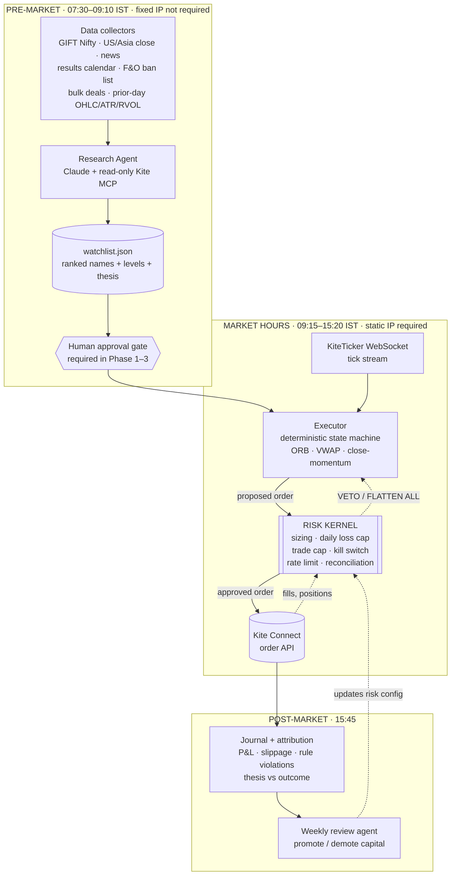

# 03 — Architecture

## Principle

**The agent researches. The code trades. The risk kernel can veto both.**

Three processes, three trust levels:

1. **Research agent** (LLM, pre-market, offline) — judgement work. Reads news,
   global cues, prior-day stats. Emits a *watchlist*: a data file. Cannot place orders.
2. **Executor** (deterministic Python, market hours) — reads the approved
   watchlist, watches the tick stream, fires orders when pre-computed conditions
   are met. No LLM call in this process, ever.
3. **Risk kernel** (deterministic, in-process, in front of every order) — the
   only code that talks to `kite.place_order`. Enforces the limits in
   [05](05-guardrails.md). Can flatten the book and disable the day.

The watchlist file is the contract between agent and executor. That boundary is
what makes the whole thing backtestable: replay historical watchlists against
historical ticks and you get a real equity curve.

## System diagram



## Daily timeline (IST)

| Time | Actor | Action |
|---|---|---|
| 07:30 | Collectors | Pull overnight cues, news, corporate actions, results calendar, F&O ban list, prior-day candles. Cache to DB. |
| 08:00 | Research agent | Rank universe, write `watchlist.json` with levels and theses. |
| 08:30 | You | Review watchlist on phone. Approve / strike names / abort the day. |
| 09:07 | Executor | Boot. Self-checks: broker auth, static-IP reachability, free margin, kill-switch state, clock skew. Refuse to start if any fail. |
| 09:15–09:30 | Executor | Observe only. Build the opening range. **No entries.** |
| 09:30–10:30 | Executor | Open-session window. Entries permitted. |
| 10:30–14:45 | Executor | Manage open positions only. **No new entries.** |
| 14:45–15:10 | Executor | Close-session window. Entries permitted. |
| 15:10 | Risk kernel | Hard stop on new entries. |
| 15:15 | Risk kernel | **Flatten everything.** Self-imposed, 10 min before Zerodha's auto square-off (15:25 equity / 15:26 F&O) to avoid square-off slippage. |
| 15:45 | Journal | Write trades, stats, thesis-vs-outcome, rule violations. Push summary to you. |
| Fri 16:00 | Review agent | Weekly stats vs promotion/demotion criteria in [06](06-rollout.md). |

The **10:30–14:45 dead zone is deliberate.** The mandate is open and close;
the midday chop is where intraday accounts bleed. No entries means no entries.

## The watchlist contract

The single interface between judgement and execution. Sketch:

```json
{
  "schema_version": 1,
  "trade_date": "2026-09-03",
  "generated_at_ist": "2026-09-02T08:04:11+05:30",
  "market_regime": {
    "gift_nifty_gap_pct": 0.42,
    "india_vix": 12.8,
    "regime": "mild_risk_on",
    "trade_day": true,
    "abort_reason": null
  },
  "candidates": [
    {
      "rank": 1,
      "tradingsymbol": "TATAMOTORS",
      "exchange": "NSE",
      "instrument_token": 884737,
      "side_bias": "long",
      "strategy": "orb_15m",
      "thesis": "US peer guidance raise overnight; sector RS positive; prior-day close above 20D with RVOL 1.8.",
      "catalyst": "peer_earnings",
      "confidence": 0.62,
      "levels": {
        "prev_close": 1042.5,
        "prev_high": 1051.0,
        "prev_low": 1028.4,
        "atr_14": 21.3,
        "avg_daily_turnover_cr": 1180
      },
      "risk": { "max_stop_pct": 0.8, "invalidate_if_gap_pct_above": 3.0 },
      "flags": { "in_fno_ban": false, "results_today": false, "ex_date_today": false }
    }
  ],
  "rejected": [
    { "tradingsymbol": "IDEA", "reason": "avg turnover below 200cr floor" }
  ],
  "human_review": { "approved": false, "approved_by": null, "struck": [] }
}
```

Rules that make this safe:

- **The executor only ever trades symbols present and approved in this file.** No
  dynamic discovery during the session. If the file is missing, malformed, stale,
  or unapproved during Phases 1–3 — the executor does not trade that day.
- The agent supplies *context and levels*, never a trigger price it invented.
  Entry triggers are computed by the executor from live data using the rules in
  [04](04-strategy-playbook.md). The agent narrows the universe; it does not time.
- `confidence` scales position size within the risk budget — it never overrides
  the ceiling.
- Every field is validated against a schema on load. Fail closed.

## Components

**Collectors** (`collectors/`) — one module per source, each returning normalised
records with a fetch timestamp. Prior-day OHLC/ATR/RVOL come from Kite historical.
News, global cues and calendars come from external feeds (see
[07](07-open-questions.md) — the data-source choice is unresolved). Every collector
must be independently cacheable and must fail soft: a dead news feed downgrades
confidence, it does not crash the pipeline.

**Research agent** (`agent/`) — Claude Agent SDK, with the hosted read-only Kite
MCP attached for account and market context, plus the collector outputs. Emits
`watchlist.json`. Runs once daily. Because it is offline and pre-market, latency
and token cost are irrelevant — use the strongest model available.

**Executor** (`executor/`) — an explicit state machine per candidate:
`WATCHING → ARMED → ENTERED → MANAGING → EXITED | REJECTED`. State is persisted to
disk on every transition so a crash-restart mid-session resumes correctly rather
than double-entering. Consumes the `KiteTicker` stream; never polls quotes (the
quote endpoint is 1 req/sec — see [01](01-landscape.md)).

**Risk kernel** (`risk/`) — the only module importing the order API. Everything
else calls `risk.submit(intent)`. Detailed in [05](05-guardrails.md).

**Journal** (`journal/`) — per-trade rows: entry/exit, planned vs actual stop,
slippage vs the trigger price, R multiple, which rule fired, and the agent's
original thesis. This table is the input to every promotion decision later.

## Tech stack

- **Python 3.12**, `pykiteconnect`, `pandas`/`polars`, `pydantic` for the
  watchlist schema.
- **DuckDB** for candles and the journal — single file, fast analytics, no server
  to run. Move to Postgres/TimescaleDB only if multi-process writes appear.
- **Claude Agent SDK** for the research agent.
- **systemd** units with `Restart=on-failure` for executor and collectors;
  `systemd` timers rather than cron (better logging, no silent failures).
- **Deployment: AWS `ap-south-1` VM with an Elastic IP**, whitelisted in the Kite
  developer account. See [02](02-regulatory.md) — this is not optional.
- **Alerting: Telegram bot or ntfy** for fills, breaches, kill-switch trips, and a
  daily heartbeat. A missing heartbeat is itself an alert.

## Secrets and access token handling

The Kite **access token is full order authority on your account** and rotates
daily via the login flow. Never in git, never in the LLM's context, never in
logs. Store in the VM's environment or a secrets manager, `chmod 600`, and add a
CI secret-scan before this ever gets a repo. The daily token refresh needs its own
small authenticated flow — one of the unresolved items in [07](07-open-questions.md).
